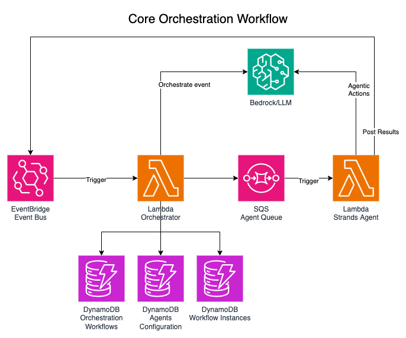
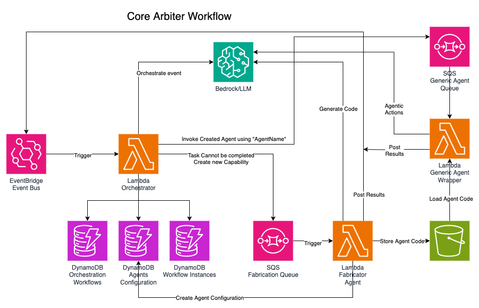
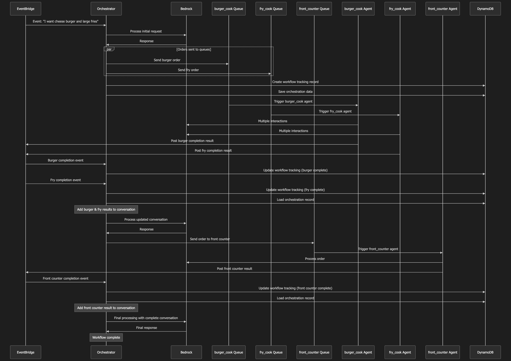
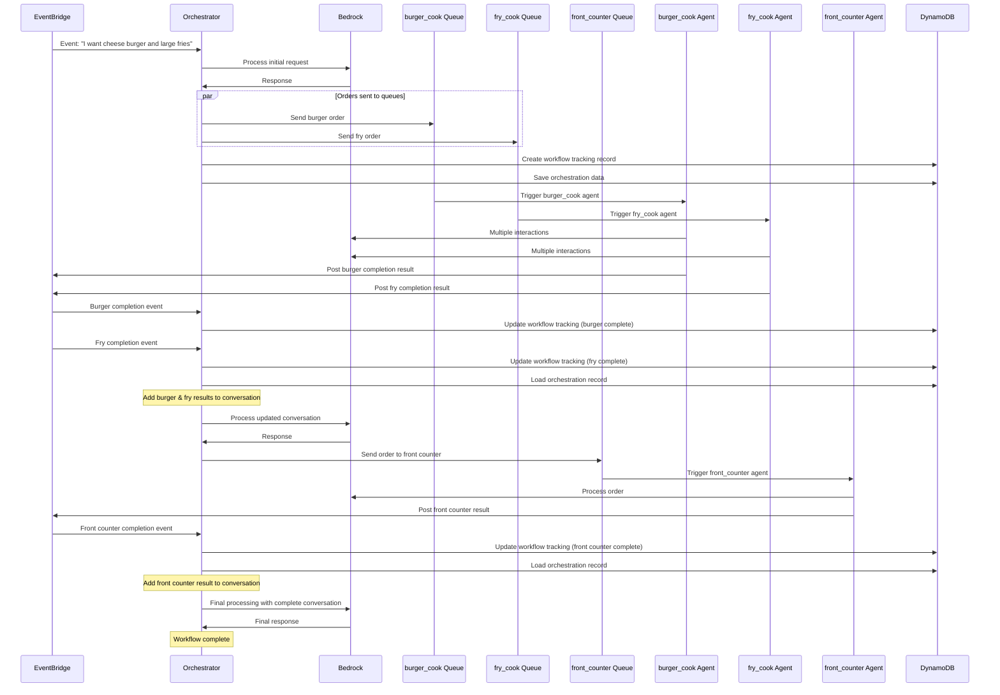
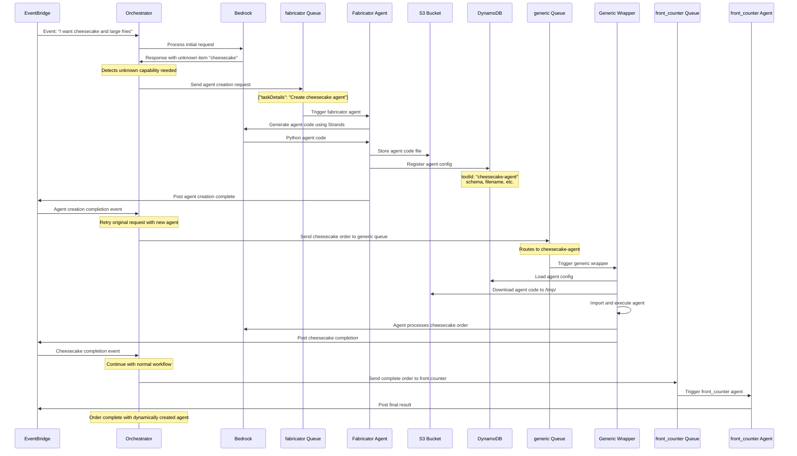

# Multi-Agent Collaboration with Strands + Arbiter Pattern

A distributed, event-driven system for processing incoming events using AWS services and autonomous agents. An Added additional layer of also "Spawning" new agents when unhandled events are encountered.

## Before proceeding, for real, don't skip this part

Enable Claude Sonnet 3.5v2 in us-west-2 region. And Nova canvas in us-east-1

## Overview

This project implements a multi-agent system that processes food orders through a series of specialized agents:

- **Front Counter Agent**: Handles customer interactions and order taking
- **Burger Cook Agent**: Prepares burger orders
- **Fry Cook Agent**: Prepares fry orders
- **Generic Agent Wrapper**: Dynamically loads and executes custom agents from S3
- **Fabricator Agent**: Creates new specialized agents on-demand using AI

The system uses AWS services including EventBridge, Lambda, SQS, S3, and DynamoDB to coordinate the workflow between agents, with Amazon Bedrock providing the AI capabilities for each agent.

## Architecture

Core Orchestration Diagram




The system architecture uses:

- **EventBridge**: For event-driven communication between components
- **SQS Queues**: To distribute work to specialized agents
- **DynamoDB**: For workflow state tracking, conversation history, and agent configuration
- **S3**: For storing dynamically created agent code as well as "delivering" the final result
- **Amazon Bedrock**: For AI agent capabilities and dynamic agent creation

## Workflow



The order processing workflow follows these steps:



### Dynamic Agent Creation Workflow

When ordering items that don't have existing agents (like cheesecake), the system creates new agents on-demand:



## Dependencies

### System Requirements

- **Python**: 3.11 or higher
- **Node.js**: 20.x or higher (for AWS CDK)
- **AWS CLI**: Configured with appropriate credentials
- **Docker Desktop**: Needed to deploy using CDK. This should be running!

### Python Dependencies

The project uses different Python packages across components:

#### Core Agent Dependencies

- `strands-agents`: AI agent framework for building conversational agents
- `strands-agents-tools`: Pre-built tools for Strands agents
- `boto3==1.38`: AWS SDK for Python

#### AWS Services Used

- **Amazon Bedrock**: Claude 3.5 Sonnet v2 (us-west-2) and Nova Canvas (us-east-1)
- **AWS Lambda**: Python 3.11 runtime
- **Amazon EventBridge**: Event-driven communication
- **Amazon SQS**: Message queuing
- **Amazon DynamoDB**: Data storage
- **Amazon S3**: Code and file storage

## Implementation Details

- The system uses DynamoDB conditional updates to ensure proper concurrency control
- A separate workflow table tracks posted messages, allowing the workflow to proceed only when all required steps are completed
- Agents communicate asynchronously through EventBridge events rather than direct API calls
- **Dynamic Agent Creation**: The fabricator function can create new specialized agents on-demand by:
  - Generating Python code using AI (Strands framework)
  - Storing the agent code in S3
  - Registering agent configuration in DynamoDB
- **Generic Agent Execution**: The generic-agent-wrapper function provides a runtime for dynamically created agents by:
  - Loading agent code from S3 into `/tmp/`
  - Dynamically importing and executing the agent
  - Handling tool configuration and event posting

## Setup

1. Create and activate a Python virtual environment:

   ```
   python3 -m venv .venv
   source .venv/bin/activate
   ```

2. Install dependencies:

   ```
   pip install -r src/agents/burger-cook/requirements.txt
   ```

3. Authenticate your current CLI with your aws account. [Help Here](https://docs.aws.amazon.com/cli/v1/userguide/cli-chap-authentication.html)

4. Deploy infrastructure using AWS CDK:

   ```
   cd infra
   npm install
   cdk deploy --all
   ```

5. Populate the tools table:

   ```
   TOOL_CONFIG_TABLE=<Table_Name_From_AWS> python src/orchestrator/add_test_data_to_dynamo.py
   ```

## Usage

### Testing with a Sample Order

You can test the system by sending a sample order event to EventBridge:

```
aws events put-events --entries file://test-event.json
```

Example test event payload:

```json
{"orderId": "12345", "customerId": "C-1234", "items": ["cheesecake", "large fries"]}
```

### Testing Dynamic Agent Creation

The fabricator function can create new agents by sending a task to the fabricator-queue. Example:

```json
{
  "tool_input": {
    "taskDetails": "Create a capability to prepare and serve cheesecake dessert items"
  },
  "orchestration_id": "unique-id",
  "tool_use_id": "tool-id",
  "node": "fabricator"
}
```

To debug fabricator-created agents, copy from tmp file to directory:

`cp /tmp/loaded_module.py ~/dev/burger/loaded_genericfn.py`

### Agent Configuration

Dynamically created agents are stored with the following configuration in DynamoDB:

- **toolId**: Unique identifier for the agent
- **config**: Contains agent metadata including:
  - `filename`: S3 object key for the agent code
  - `schema`: OpenAPI schema for tool parameters
  - `description`: Human-readable description
  - `action`: SQS queue configuration for execution

## Project Structure

- `src/agents/`: Contains the specialized agent implementations
  - `burger-cook/`: Burger preparation agent
  - `fry-cook/`: Fries preparation agent
  - `front-counter/`: Customer-facing order handling agent
- `src/orchestrator/`: Main workflow orchestration logic
- `src/generic-agent-wrapper/`: Runtime wrapper for dynamically created agents
- `src/fabricator/`: AI-powered agent creation system using Strands framework
- `infra/`: AWS CDK infrastructure code
